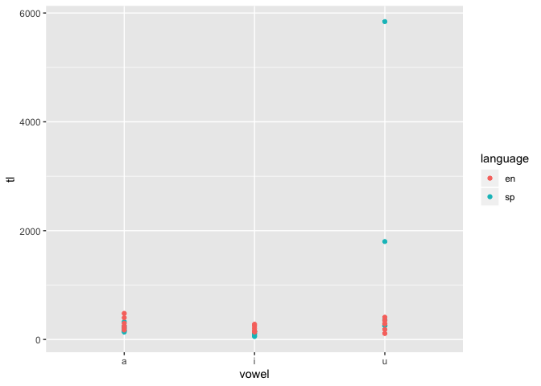
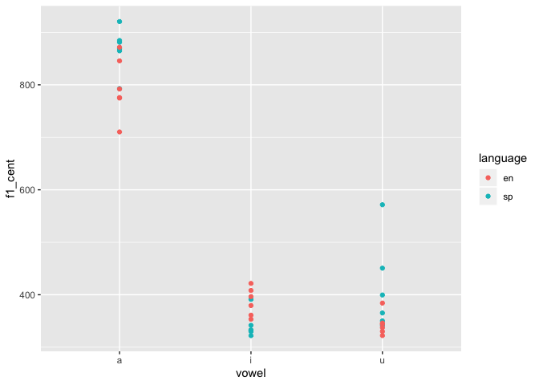
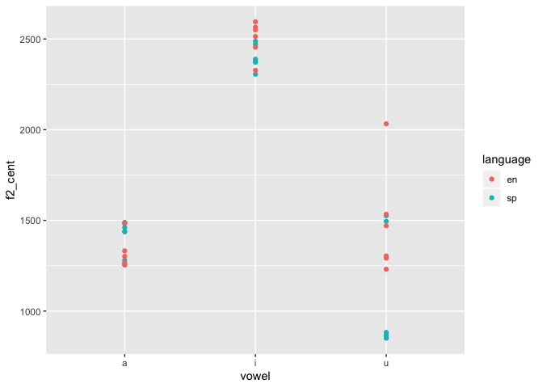

Tarea de programación número 3
================

``` r
library(tidyverse)
vocales = read.csv("data/vowel_data.csv")
```

## Cifras

Promedio y desviación estándar de primer formante (F1), segundo formante
(F2), y longitud de trayecto (LT)

``` r
vocales %>%
    summarise(Promedio_F1 = mean(f1_cent), DE_F1 = sd(f1_cent), Promedio_F2 = mean(f2_cent), DE_F2 = sd(f2_cent),  Promedio_LT = mean(tl), DE_LT = sd(tl)) 
```

    ##   Promedio_F1    DE_F1 Promedio_F2    DE_F2 Promedio_LT    DE_LT
    ## 1    524.8967 227.2581    1700.825 582.0325    423.5519 970.2177

## Gráficas

### Longitud de trayecto de vocales en función de vocal y lengua:

``` r
  ggplot(vocales, aes(color= language, y=tl, x=vowel)) + 
  geom_point(position="dodge", stat="identity")
```

    ## Warning: Width not defined. Set with `position_dodge(width = ?)`

<!-- -->

### Primer formante de vocales en función de vocal y lengua

``` r
ggplot(vocales, aes(color= language, y=f1_cent, x=vowel)) + 
geom_point(position="dodge", stat="identity")
```

    ## Warning: Width not defined. Set with `position_dodge(width = ?)`

<!-- -->

### Segundo formante de vocales en funcion de vocal y lengua

``` r
ggplot(vocales, aes(color= language, y=f2_cent, x=vowel)) + 
geom_point(position="dodge", stat="identity")
```

    ## Warning: Width not defined. Set with `position_dodge(width = ?)`

<!-- -->

## Espacio vocálico

``` r
vowel_means <- vocales %>% 
  group_by(vowel, language) %>% 
  summarize(f1_cent = mean(f1_cent), f2_cent = mean(f2_cent)) %>% 
  ungroup() %>% 
  mutate(order = case_when(vowel == "i" ~ 1, vowel == "a" ~ 2, TRUE ~ 3), 
         vowel = forcats::fct_reorder2(vowel, vowel, order)) %>% 
  arrange(order)

vocales %>% 
  mutate(vowel = forcats::fct_relevel(vowel, "u", "a", "i")) %>% 
  ggplot(., aes(x = f2_cent, y = f1_cent, color = language, label = vowel)) + 
    geom_text(size = 3.5, alpha = 0.6, show.legend = F) + 
    geom_path(data = vowel_means, aes(group = language, lty = language), 
              color = "grey") + 
    geom_text(data = vowel_means, show.legend = F, size = 7) + 
    scale_y_reverse() + 
    scale_x_reverse() + 
    scale_color_brewer(palette = "Set1") + 
    labs(title = "Comparación del espacio vocálico", 
         subtitle = "Centroides espectrales de las vocales cardinales inglesas/españolas", 
         y = "F1 (hz)", x = "F2 (hz)") + 
    theme_minimal(base_size = 16)
```


## Preguntas

1.  El código sirve para darnos una idea de cómo una vocal evoluciona en
    diferentes instantes de su articulación. Para hacerlo, es necesario
    entender dónde empieza y dónde termina la vocal dentro del estímulo
    grabado. Después, se puede programar un código que mide los valores
    formánticos en diferentes momentos dados (i.e. a 20% de la duración
    total de la vocal) para ver cómo las propiedades acústicas cambian a
    través de su producción. Este tipo de calculación ofrece más
    información sobre la variación en la producción de las vocales entre
    lenguas, dialectos, y hablantes comparado con la calculación del
    centroide que sólo ofrece un sólo punto de datos. Puesto de otra
    manera, los centroides no pueden ilustrar de manera completa cómo
    las propiedades acústicas de una vocal cambian a lo largo de su
    duracion.

2.  Hay tres partes del scrip. La primera parte se trata de buscar el
    estímulo en el directorio que hicimos en RStudio al inicio del
    proyecto, y crear un archivo de CSV – es decir, sirvió para que
    especificáramos el input y el output para el resto del scrip. Nótese
    que hay *relative paths* para poder reproducir la extracción de
    datos en otro momento. También mandamos crear las columnas a las que
    se iban a entregar los datos. La segunda parte contenía el código
    necesario para sacar la información del *textgrid* de PRAAT y
    entregar los datos en las columnas relevantes del CSV para una de
    las vocales del estímulo. Por último, la tercera parte del scrip
    sirvió para que el proceso de extracción de datos se repitiera con
    las otras vocales del estímulo, según se hizo en la parte anterior.
    Con estas tres partes, conseguimos localizar la fuente de datos
    (nuestro estímulo en forma de textgrid) y sacar los datos del
    estimulo para que se representasen en un archivo CSV. Después, nos
    fue posible analizar y manipular estos datos en RStudio.

3.  En la tarea anterior, medimos el punto medio de la vocal mediante el
    *point tier*, y esta semana, lo usamos para especificar a cuál la
    lengua pertenecía cada estímulo (inglés/español). En el estímulo de
    la tarea de programación número 2, generamos datos para la
    intensidad, la duración, y el tono, y calculamos nuestros datos en
    función de la acentuación (oxítono/paroxítono). Sin embargo, esta
    vez creamos funciones para la lengua y la vocal (/ a i u/). La
    ventaja de calcular la longitud del trayecto es el fónomeno que he
    explicado en la pregunta \#1, pero la desventaja es que no
    reportamos los valores del tono, intonación, y acentuación léxica de
    nuestras vocales. Es decir, buscamos diferentes variables: la
    primera tarea fue mas general, pero dentro de una variable
    específica (la duración), conseguimos demostrar cómo las vocales
    progresaron por el tiempo mediante el uso de la longitud de
    trayecto. Una ultima diferencia es que calculamos la desviación
    estandar en la tarea numero 3, pero no en la 2.
